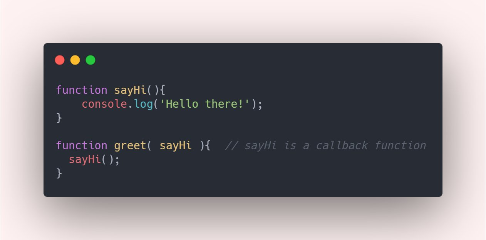

### Fun with Callbacks

by Sandeep
---

##### Quck note about Wrong Answers and Stupid Questions

---

## Agenda

Different Types of Functions <!-- .element: class="fragment" -->

Functions as First-class Citizens <!-- .element: class="fragment" -->

Higher-Order Functions <!-- .element: class="fragment" -->

Callbacks <!-- .element: class="fragment" -->

Single Responsibility Principle <!-- .element: class="fragment" -->

Arrow Functions <!-- .element: class="fragment" -->

Live Coding<!-- .element: class="fragment" -->

---

##### Quick Review of Different Types of Functions

- What is a function? 
- Difference between parameter & argument?

---

---

### Types of Function

<section style="text-align: left;">

Function Declaration 
 <pre><code data-trim data-noescape>
  function printUserName(){}
  </code></pre> <!-- .element: class="fragment" -->

Function Expression
 <pre><code data-trim data-noescape>
 const printUserName = function(){}
  </code></pre>
 <!-- .element: class="fragment" -->

Anonymous Functions
 <pre><code data-trim data-noescape>
function(){}
  </code></pre>
 <!-- .element: class="fragment" -->

Arrow Functions
 <pre><code data-trim data-noescape>
const printUserName = () => {}
  </code></pre>
 <!-- .element: class="fragment" -->

</section>

---

### Explore on your own

What is Function Hoisting?

Function Calling/Invoking Vs. Function Passing

Passing By Reference

---

### Repeat After Me

## Functions in JavaScript are first class citizens!

A function can be treated like any other value in JS<!-- .element: class="fragment" -->

It can be assigned to a variable<!-- .element: class="fragment" -->

It can be passed as an argument<!-- .element: class="fragment" -->

It can returned by another function<!-- .element: class="fragment" -->

---

### Higher Order Functions

What is Higher Order Function?

> A function that accepts another function as an input parameter or return another function
<!-- .element: class="fragment" -->

Some of my favorite JavaScript HOCs
 <pre><code data-trim data-noescape>
.map
.reduce
.filter
.forEach
.some
.every
  </code></pre>
 <!-- .element: class="fragment" -->

Why do we need them? <!-- .element: class="fragment" -->

---

### Single Responsbility Principle

A function should do only one thing at a time! <!-- .element: class="fragment" -->

---

### What are callbacks? 

---

### What are arrow functions?

---

### forEach Demo

---

### Scope Chain Quick Demo

---

### Exercise (live-code)

Let's code together `forEachInReverse` that does reverse iteration on an array and takes a cb much like forEach would.